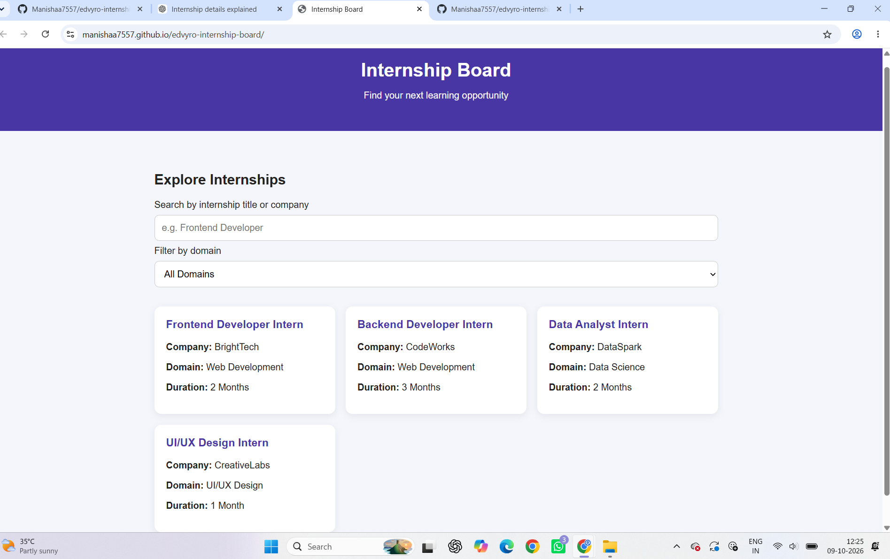

# Responsive Internship Board

## About the Project

The Responsive Internship Board is a simple website that helps users explore internship opportunities by searching for internship titles or company names and filtering by domain.

## Features

* Search internships by title or company
* Filter internships by domain
* Responsive layout for desktop, tablet, and mobile
* Displays a message when no matching internships are found
* Keyboard-friendly form controls

## Technologies Used

* HTML
* CSS
* JavaScript

## Live Demo

https://manishaa7557.github.io/edvyro-internship-board/

## GitHub Repository

https://github.com/Manishaa7557/edvyro-internship-board

## How to Run

1. Download or clone this repository.
2. Open `index.html` in a web browser.

## Note

The website currently uses sample internship data for demonstration purposes.

## Screenshot

